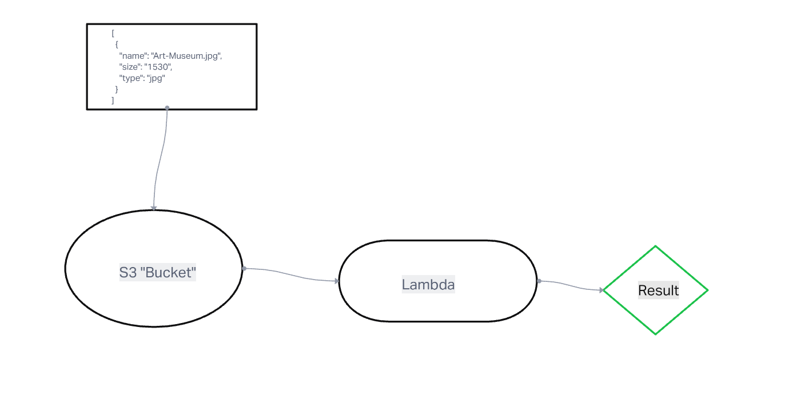

# LAB - Class 17

## Project: AWS: S3 and Lambda

### Author: Yen Xiong Yuan

### Problem Domain

This is a lambda function update and return of images from the JSON file.

### Access the link here

- [https://yen-images.s3.amazonaws.com/images.json](https://yen-images.s3.amazonaws.com/images.json)

#### UML

